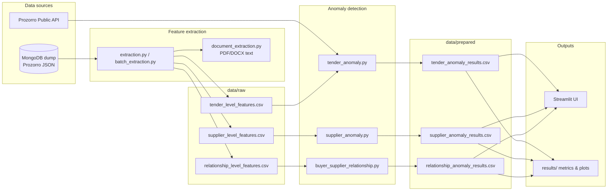

# Procurement Anomaly Detection (Prozorro)

An unsupervised machine learning system for detecting suspicious patterns in Ukrainian public procurement data from the [Prozorro](https://prozorro.gov.ua/) open contracting platform. The project was developed as a diploma thesis and combines **numeric**, **semantic (NLP)**, and **rule-based relationship** analysis across three levels: individual tenders, supplier profiles, and buyer–supplier pairs.

---

## What problem does this solve?

Public procurement is a high-risk domain for fraud, collusion, and non-competitive behavior. Labeled datasets of confirmed corruption cases are scarce, so the system uses **unsupervised anomaly detection** to flag entities that deviate from typical patterns — helping auditors and analysts prioritize cases for manual review.

The approach mirrors how an investigator might think:

| Level | Question | Method |
|-------|----------|--------|
| **Tender** | Is this procurement unusual in price, competition, or description? | Isolation Forest + SBERT semantic outliers |
| **Supplier** | Does this bidder behave unlike peers? | Ensemble: K-Means + Isolation Forest + LOF |
| **Buyer–supplier pair** | Is there a concentrated, low-competition relationship? | Interpretable rule-based risk score |

---

## Architecture



---

## Key techniques

### Tender-level anomalies (`scr/train/tender_anomaly.py`)

- **Numeric risk:** Isolation Forest on financial, temporal, and competition features, with CPV-group-aware normalization (falls back to global stats for small groups).
- **Semantic risk:** Multilingual SBERT embeddings (`paraphrase-multilingual-mpnet-base-v2`) of tender titles/descriptions → UMAP reduction → HDBSCAN clustering → outlier scoring via cosine similarity to cluster centroids.
- **Blended risk score:** Weighted combination of numeric percentile, semantic percentile, and semantic outlier flag.
- **Optional document NLP:** Tier-1 tender documents (PDF/DOCX) can be fetched and embedded for additional text signal.

### Supplier-level anomalies (`scr/train/supplier_anomaly.py`)

- **Ensemble consensus:** A supplier is flagged if **≥ 2 of 3** detectors agree:
  1. **K-Means** — negative silhouette within cluster (collective deviation)
  2. **Isolation Forest** — global point outlier
  3. **LOF** — local density outlier
- Final `risk_score` aggregates z-normalized detector strengths with a consensus bonus.

### Buyer–supplier relationships (`scr/train/buyer_supplier_relationship.py`)

Transparent, weighted rule engine (max score 9):

| Rule | Weight | Trigger |
|------|--------|---------|
| High win share | 2 | Supplier wins > 70% of buyer's tenders |
| Low competition | 1 | Average ≤ 2 competitors |
| Repeated pair | 2 | ≥ 5 tenders together |
| High supplier income share | 1 | > 50% of supplier revenue from this buyer |
| High single-bid share | 2 | > 50% of procedures had one bidder |
| High average price | 1 | Price in top quartile |

Risk levels: **low** (0–3), **medium** (4–5), **high** (6+).

---

## Project structure

```
procurement-anomaly-detection/
├── scr/
│   ├── prepare/
│   │   ├── extraction.py           # Feature engineering from JSON tenders
│   │   ├── batch_extraction.py     # Scalable batch processing with checkpoints
│   │   └── document_extraction.py  # Optional document download & NLP
│   ├── train/
│   │   ├── tender_anomaly.py       # Tender anomaly detection
│   │   ├── supplier_anomaly.py     # Supplier ensemble detection
│   │   └── buyer_supplier_relationship.py  # Rule-based pair scoring
│   ├── test/
│   │   ├── evaluation.py           # Unsupervised model evaluation
│   │   ├── compare_methods_tender.py / compare_methods_supplier.py
│   │   ├── threshold_stability.py  # Threshold sensitivity analysis
│   │   ├── cpv_granularity_experiment.py
│   │   └── analyze_relationship.py
│   ├── prozorro_live.py            # Score a live tender via Prozorro API
│   └── ui.py                         # Streamlit dashboard
├── notebooks/                      # EDA, SHAP feature importance
├── results/                        # Metrics tables, plots, CSV summaries
├── data/                           # Raw & prepared CSVs (not in git — see below)
└── requirements.txt
```

---

## Getting started

### Prerequisites

- Python 3.10+
- **MongoDB** (local) with a Prozorro tender dump, *or* pre-built CSV feature files in `data/raw/`
- ~4 GB RAM recommended (SBERT model + UMAP/HDBSCAN for full tender run)

### Installation

```bash
git clone <repository-url>
cd procurement-anomaly-detection

python -m venv .venv
# Windows
.venv\Scripts\activate
# Linux / macOS
source .venv/bin/activate

pip install -r requirements.txt
pip install streamlit pyvis joblib   # UI & model caching (not in requirements.txt)
```

> First run of tender anomaly detection downloads the SentenceTransformer model (~400 MB).

### Data layout

The `data/` directory is gitignored. Expected structure:

```
data/
├── raw/
│   ├── tender_level_features.csv
│   ├── supplier_level_features.csv
│   └── relationship_level_features.csv
├── prepared/
│   ├── tender_anomaly_results.csv
│   ├── supplier_anomaly_results.csv
│   └── relationship_anomaly_results.csv
└── cache/                  # SBERT embeddings, UMAP models (auto-created)
```

---

## Running the pipeline

All commands assume the project root as working directory unless noted.

### 1. Feature extraction (from MongoDB)

Configure the MongoDB connection and collection in `scr/prepare/batch_extraction.py`, then:

```bash
cd scr/prepare
python batch_extraction.py
```

For a smaller one-off extraction, edit and run `scr/prepare/extraction.py`.

Environment variables:

| Variable | Default | Description |
|----------|---------|-------------|
| `DOCUMENT_FETCH` | `1` | Set to `0` to skip downloading tender documents |

### 2. Train / score anomaly models

```bash
cd scr/train
python tender_anomaly.py      # → data/prepared/tender_anomaly_results.csv
python supplier_anomaly.py    # → data/prepared/supplier_anomaly_results.csv
python buyer_supplier_relationship.py  # → data/prepared/relationship_anomaly_results.csv
```

Smoke test (subset of tenders, faster):

```bash
set SMOKE_TENDER_ANOMALIES=1
set SMOKE_TENDER_ANOMALIES_N=200
python tender_anomaly.py
```

### 3. Evaluation & experiments

```bash
python scr/test/evaluation.py
python scr/test/compare_methods_tender.py
python scr/test/compare_methods_supplier.py
python scr/test/analyze_relationship.py
python scr/test/threshold_stability.py
python scr/test/cpv_granularity_experiment.py
```

Outputs are saved under `results/` (metrics CSVs, histograms, PCA/UMAP plots, SHAP charts).

### 4. Interactive dashboard

Requires prepared CSVs in `data/prepared/`:

```bash
streamlit run scr/ui.py
```

The UI provides three tabs:

1. **Live tender check** — enter a Prozorro CDB internal ID (32 hex chars) to fetch from the public API and score on the fly
2. **Supplier profile** — browse and inspect supplier risk scores
3. **Relationship graph** — interactive PyVis network of high-risk buyer–supplier pairs

---

## Evaluation methodology

Because there are no ground-truth anomaly labels, evaluation relies on:

- **Clustering quality:** Silhouette score, Davies–Bouldin index (where clustering applies)
- **Score distribution:** Shape of risk scores and 99th-percentile threshold stability
- **Visual validation:** 2D PCA / UMAP projections colored by anomaly score
- **Method comparison:** Benchmarking IF, LOF, DBSCAN, One-Class SVM, and ensembles across sample sizes
- **Feature importance:** SHAP, permutation importance, and Isolation Forest impurity on tender/supplier features

Example findings from method comparison (full dataset ~11k tenders):

- **Tenders:** Isolation Forest selected as primary numeric detector (stable ~20% anomaly rate, good Silhouette ~0.37)
- **Suppliers:** K-Means + IF + LOF ensemble (Silhouette up to ~0.71, ~4% anomaly rate at full scale)
- **Relationships:** 5,016 buyer–supplier pairs scored; ~10% classified as high risk

---

## Tech stack

| Category | Libraries |
|----------|-----------|
| Data | pandas, numpy, pymongo |
| ML / stats | scikit-learn, scipy, umap-learn, hdbscan |
| NLP | sentence-transformers, pypdf, python-docx |
| Explainability | SHAP |
| Visualization | matplotlib, seaborn |
| UI | Streamlit, PyVis |
| API | requests (Prozorro public API v2.5) |

---

## Notebooks

Exploratory analysis and feature-importance studies live in `notebooks/`:

- `eda_tender.ipynb`, `eda_supplier.ipynb`, `eda_relationship.ipynb` — data exploration
- `feature_importance_shap.ipynb`, `feature_importance_tender_supplier.ipynb` — interpretability
- `features.ipynb`, `describe.ipynb` — feature documentation

---

## Results artifacts

Pre-generated outputs in `results/` include:

- `tender_results/`, `supplier_results/` — method comparison metrics and visualizations
- `evaluation_results/` — model evaluation plots
- `relationship_results/` — rule statistics, co-occurrence heatmaps, top suspicious pairs
- `feature_importance/` — SHAP beeswarm, permutation bars, importance summaries

These can be reviewed without re-running the full pipeline.

---

## Limitations & disclaimer

- **Unsupervised:** High risk scores indicate statistical unusualness, not proven fraud.
- **Data scope:** Features are derived from open Prozorro JSON; document coverage depends on availability and `DOCUMENT_FETCH` settings.
- **No production deployment:** This is a research / thesis prototype, not an audited compliance tool.

---

## License

Academic / research project. Add a license file if you plan to open-source or redistribute.
